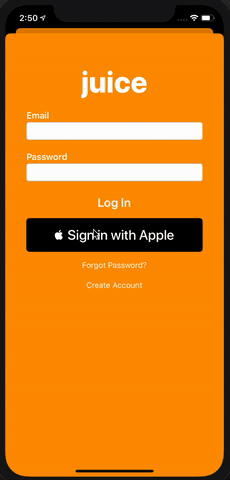

# Apple Sign In Example

This is an example project to implement Apple SIgn In feature
 
 ### Installation
 
 - You have to add a valid Bundle ID with the Apple Sign In feature enabled 
 - Set your Team in the "Signing Capabilities" (Make sure )
 
### Links
* [Apple Example](https://developer.apple.com/documentation/authenticationservices/implementing_user_authentication_with_sign_in_with_apple)
* [Getting Started](https://developer.apple.com/sign-in-with-apple/get-started/)

### Image

